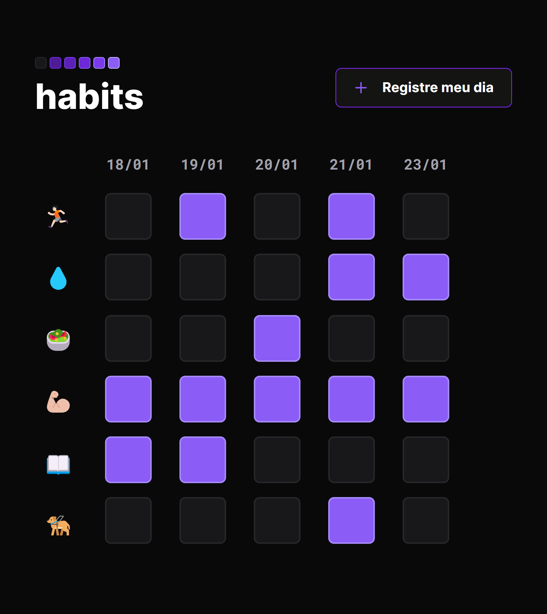

<h1 align="center"> Habit </h>

<h2> NLW e um  evento exclusivo gratuito promovido pela Rocketseat para ensino de tecnologia WEB .  </h2> 

<h2>
   <a href="#-tecnologia">Tecnologias</a>&nbsp;&nbsp;&nbsp;|&nbsp;&nbsp;&nbsp;
   <a href="#-tecnologia">Projetos</a>&nbsp;&nbsp;&nbsp;|&nbsp;&nbsp;&nbsp;
   <a href="#-tecnologia">Loyaut</a>&nbsp;&nbsp;&nbsp;|&nbsp;&nbsp;&nbsp;
   <a href="#memo-tecnologia">licença</a>
</h2>

 

  

## 🤖 Tecnologias

<h3>Esse projeto foi desenvolvido com as seguintes tecnologias</h3>
 

- HTML
- CSS
- JavaScript
- Git/Github
- Figma

## 🖥️ Projeto

Projeto Habits e um app para  ajudar rastrear os habitos diarios.

- [📌Acesse o projeto finalizado, online](https://jeferson-3.github.io/SetupNwl/)

## loyout 📃

você pode visualizar o loyout atravez do 
[DESSE LINK](https://www.figma.com/community/file/1187422022288947321).  
E necessario ter conta no [Figma](https://figma.com) para acessa-lo

## :memo: Licença
Essa licença esta sob a licença MIT